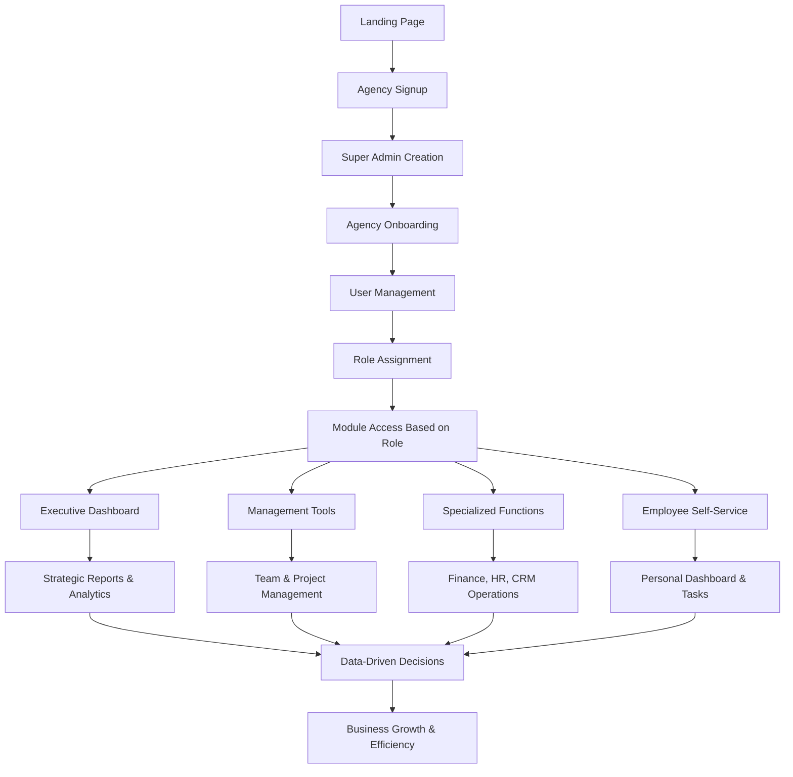

# BuildFlow System Overview & Analysis

**Date:** September 2, 2025  
**Document Type:** System Analysis & Feature Documentation  
**Version:** 1.0

---

## Table of Contents

1. [System Overview](#system-overview)
2. [System Workflow](#system-workflow)
3. [Core Features & Modules](#core-features--modules)
4. [Technical Architecture](#technical-architecture)
5. [Security & Compliance](#security--compliance)
6. [Potential Implementations](#potential-implementations)
7. [Role Hierarchy](#role-hierarchy)
8. [Database Schema](#database-schema)

---

## System Overview

**BuildFlow** is a comprehensive multi-tenant SaaS platform designed specifically for agencies and professional service organizations. The system provides end-to-end business management capabilities with a sophisticated 22-tier role hierarchy and modular architecture.

### Key Characteristics:
- **Multi-tenant Architecture**: Each agency operates in isolation
- **Role-based Access Control**: 22 distinct user roles with granular permissions
- **Modular Design**: Project management, finance, HR, CRM, and analytics modules
- **Scalable Infrastructure**: Built on modern tech stack with Supabase backend

---

## System Workflow

### Workflow Stages:

1. **Agency Registration**: New agencies sign up and create super admin accounts
2. **Onboarding**: Guided setup process for agency configuration
3. **User Management**: Adding employees and assigning appropriate roles
4. **Module Access**: Role-based access to different system modules
5. **Daily Operations**: Users interact with features based on their permissions
6. **Analytics & Reporting**: Data collection and business intelligence

---

## Core Features & Modules

### 1. Authentication & User Management
- **Multi-tenant Architecture**: Complete agency isolation
- **22-Tier Role System**: Granular permission control
- **Secure Onboarding**: Guided setup with best practices
- **Role-based Access Control**: Dynamic feature access
- **User Profile Management**: Comprehensive user data

### 2. Human Resources Management
- **Employee Database**: Complete employee information management
- **Attendance Tracking**: Clock in/out with location tracking
- **Leave Management**: Request, approval, and tracking system
- **Payroll Integration**: Salary calculation and processing
- **Performance Management**: Reviews and goal tracking
- **Document Management**: Employee file storage and access

### 3. Customer Relationship Management (CRM)
- **Lead Management**: Lead capture and nurturing
- **Client Database**: Comprehensive client information
- **Sales Pipeline**: Deal tracking and forecasting
- **Activity Tracking**: Client interaction history
- **Lead Source Analytics**: ROI tracking for marketing channels

### 4. Project & Job Management
- **Project Planning**: Timeline and milestone management
- **Job Costing**: Real-time cost tracking and analysis
- **Task Management**: Assignment and progress tracking
- **Resource Allocation**: Team and equipment scheduling
- **Progress Monitoring**: Real-time project status updates

### 5. Financial Management
- **Invoicing System**: Automated invoice generation
- **Payment Tracking**: Receivables and payables management
- **Expense Management**: Employee expense tracking and reimbursement
- **Accounting Integration**: Ledger and financial reporting
- **Budget Management**: Planning and variance analysis
- **Financial Reporting**: P&L, cash flow, and balance sheets

### 6. Quotation & Proposal System
- **Quote Templates**: Standardized pricing structures
- **Line Item Management**: Detailed service and product pricing
- **Approval Workflows**: Multi-level quote approval process
- **Client Portal**: Self-service quote viewing and acceptance
- **Version Control**: Quote revision tracking

### 7. Reporting & Analytics
- **Executive Dashboards**: High-level KPI monitoring
- **Custom Reports**: User-defined reporting capabilities
- **Data Export**: Multiple format support (PDF, Excel, CSV)
- **Real-time Analytics**: Live data visualization
- **Trend Analysis**: Historical data insights

---

## Technical Architecture

### Frontend Stack
- **React 18**: Modern component-based UI framework
- **TypeScript**: Type-safe development
- **Tailwind CSS**: Utility-first styling approach
- **Radix UI**: Accessible component primitives
- **React Router**: Client-side routing
- **React Hook Form**: Form state management
- **Tanstack Query**: Server state management

### Backend Infrastructure
- **Supabase**: Backend-as-a-Service platform
- **PostgreSQL**: Primary database with advanced features
- **Row Level Security (RLS)**: Database-level security
- **Real-time Subscriptions**: Live data updates
- **Edge Functions**: Serverless compute (Deno runtime)
- **File Storage**: Secure document and media storage

### Authentication & Security
- **Supabase Auth**: JWT-based authentication
- **Multi-factor Authentication**: Enhanced security options
- **Role-based Permissions**: Granular access control
- **API Security**: Rate limiting and validation
- **Data Encryption**: At-rest and in-transit encryption

---

## Security & Compliance

### Data Protection
- **Row Level Security (RLS)**: Database-level access control
- **Audit Logging**: Comprehensive activity tracking
- **Encrypted Storage**: Sensitive data encryption
- **Role-based Permissions**: Principle of least privilege
- **Regular Backups**: Automated data protection
- **GDPR Compliance**: Data privacy regulations adherence

### Security Features
- **Multi-tenant Isolation**: Complete data separation
- **API Rate Limiting**: Protection against abuse
- **Input Validation**: XSS and injection prevention
- **Secure File Upload**: Malware scanning and validation
- **Session Management**: Secure token handling

---

## Potential Implementations

### Immediate Enhancements

#### Advanced Analytics & Business Intelligence
- **Predictive Analytics**: AI-powered forecasting
- **Custom Dashboards**: Drag-and-drop dashboard builder
- **Advanced Reporting**: Complex multi-table reports
- **Data Visualization**: Interactive charts and graphs
- **Export Capabilities**: Multiple format support

#### Communication & Collaboration
- **Internal Messaging**: Team communication system
- **Video Conferencing**: Integrated meeting capabilities
- **File Sharing**: Secure document collaboration
- **Team Chat**: Real-time messaging
- **Notification System**: Smart alert management

#### Mobile Applications
- **Native iOS/Android Apps**: Full mobile experience
- **Offline Capabilities**: Work without internet
- **Push Notifications**: Real-time alerts
- **Mobile-optimized UI**: Touch-friendly interface
- **Geolocation Features**: Location-based tracking

#### API & Integrations
- **Third-party Integrations**: Popular business tools
- **Webhook System**: Real-time data synchronization
- **RESTful API**: Public API for custom integrations
- **Single Sign-On (SSO)**: Enterprise authentication
- **Import/Export Tools**: Data migration utilities

### Advanced Feature Possibilities

#### AI-Powered Features
- **Intelligent Document Processing**: Automated data extraction
- **Predictive Project Management**: Risk assessment and timeline prediction
- **Smart Resource Allocation**: AI-optimized team assignments
- **Automated Reporting**: AI-generated insights and recommendations
- **Chatbot Assistant**: Natural language system interaction

#### Advanced Project Management
- **Gantt Charts**: Visual project timeline management
- **Resource Planning**: Advanced scheduling algorithms
- **Project Templates**: Standardized project setups
- **Milestone Tracking**: Automated progress monitoring
- **Risk Management**: Issue identification and mitigation

#### Enhanced Financial Features
- **Multi-currency Support**: Global business operations
- **Tax Management**: Automated tax calculations
- **Financial Forecasting**: Predictive financial modeling
- **Budget Variance Analysis**: Automated variance reporting
- **Cash Flow Management**: Liquidity planning tools

#### Workflow Automation
- **Business Process Automation**: Custom workflow creation
- **Approval Workflows**: Multi-stage approval processes
- **Automated Notifications**: Smart alert systems
- **Document Generation**: Template-based document creation
- **Integration Automation**: Cross-system data synchronization

### Enterprise-Level Enhancements

#### Scalability Features
- **Multi-location Support**: Geographic distribution management
- **Advanced User Permissions**: Complex role hierarchies
- **White-label Solutions**: Custom branding capabilities
- **API Rate Limiting**: Performance optimization
- **Load Balancing**: High-availability architecture

#### Advanced Security
- **Zero-trust Architecture**: Enhanced security model
- **Advanced Audit Logging**: Comprehensive compliance tracking
- **Data Loss Prevention**: Automated data protection
- **Compliance Frameworks**: SOC 2, ISO 27001 support
- **Advanced Encryption**: End-to-end data protection

---

## Role Hierarchy

The system implements a comprehensive 22-tier role hierarchy:

### Executive Level
1. **Super Admin** - Complete system control
2. **Agency Owner** - Agency-wide management
3. **Executive Director** - Strategic oversight

### Management Level
4. **General Manager** - Operational management
5. **Department Head** - Departmental leadership
6. **Project Manager** - Project oversight
7. **Team Lead** - Team coordination

### Specialized Roles
8. **HR Manager** - Human resources management
9. **Finance Manager** - Financial oversight
10. **Sales Manager** - Sales operations
11. **Marketing Manager** - Marketing activities

### Professional Level
12. **Senior Developer** - Technical leadership
13. **Developer** - Software development
14. **Designer** - Creative design work
15. **Analyst** - Data analysis and reporting

### Support Roles
16. **Administrator** - System administration
17. **Coordinator** - Process coordination
18. **Assistant** - Administrative support
19. **Intern** - Learning and support role

### Client-facing Roles
20. **Account Manager** - Client relationship management
21. **Client** - External client access
22. **Contractor** - External contractor access

---

## Database Schema

### Core Tables
- **agencies**: Multi-tenant organization data
- **profiles**: User profile information
- **employees**: Employee-specific data
- **projects**: Project management data
- **clients**: Client relationship data
- **invoices**: Financial transaction data
- **time_entries**: Time tracking data
- **reimbursements**: Expense management data

### Security Implementation
- **Row Level Security (RLS)**: Enabled on all tables
- **Agency Isolation**: Complete data separation
- **Role-based Access**: Function-level permissions
- **Audit Trails**: Comprehensive change tracking

---

## Conclusion

BuildFlow represents a comprehensive business management platform with significant potential for expansion and enhancement. The current architecture provides a solid foundation for scaling and adding advanced features while maintaining security and performance standards.

The modular design and role-based architecture make it suitable for agencies of various sizes and types, from small startups to large enterprise organizations.

---

**Document Prepared By:** Lovable AI Assistant  
**Last Updated:** September 2, 2025  
**Next Review Date:** September 2, 2026